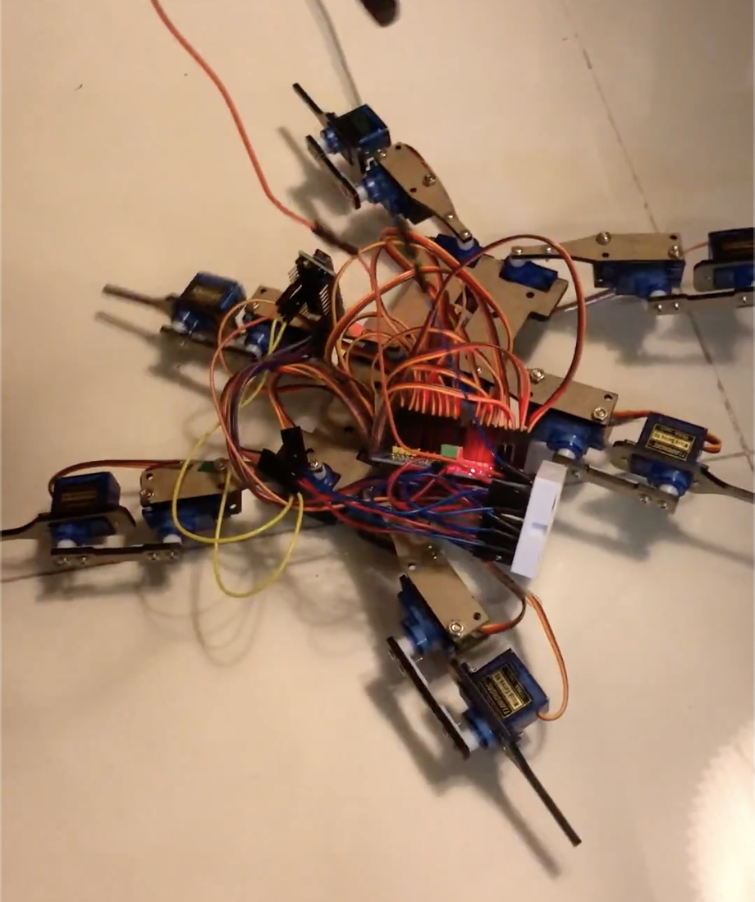
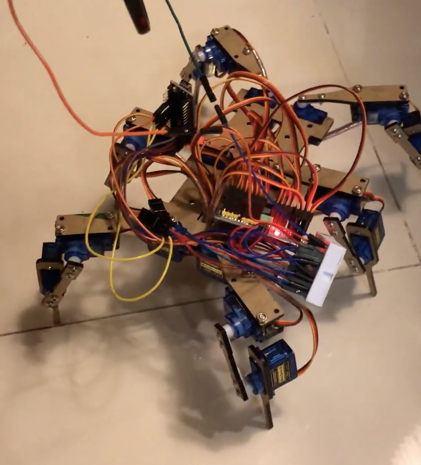
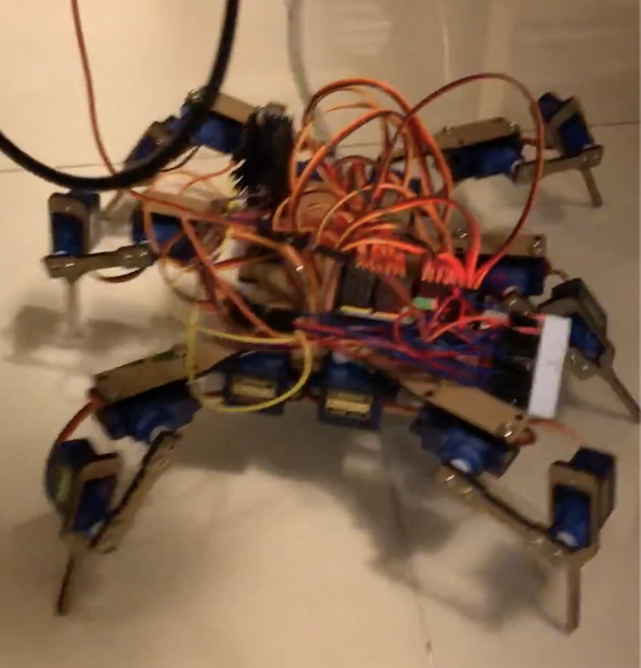
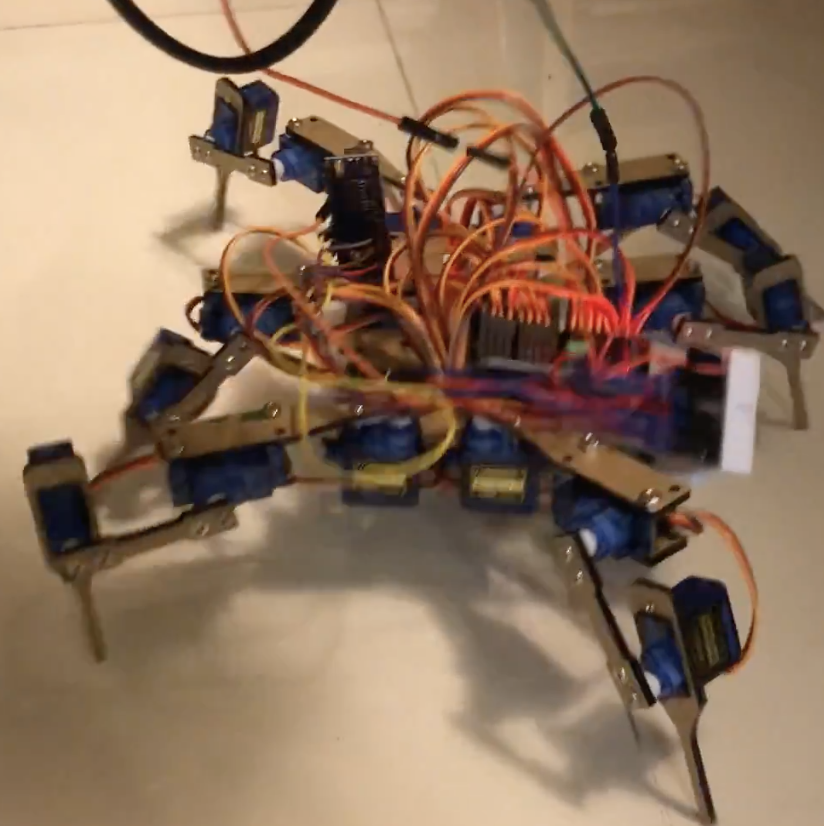

# Hexapod
This is an Arduino project involves Nano board, IRRemote, PCA9685, and 18 sg90 0-180 servo motors.

The robot can walk. I tried to let the robot jump, but it is too heavy while the servo motors aren't powerful enough. It has an infrared remote controller to control its state.

| Reset | Standing | Walking 1 | Walking 2 |
| ----- | -------- | --------- | --------- |
|  |  |  |  |